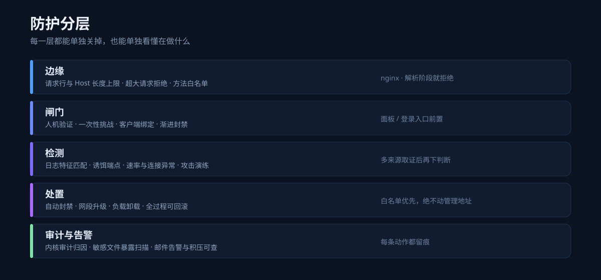
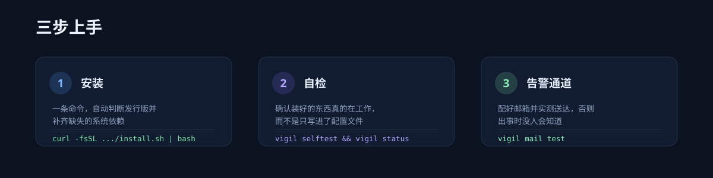

<div align="center">
  
</div>

# vigil-guard

[](https://github.com/QiuXiYueShiJiu/vigil-guard/actions/workflows/ci.yml)
[](LICENSE)
[](https://www.python.org/)
[](#技术栈与参考文献)
[](#环境要求)

> ## ⚠️ 声明
>
> **这是由 dsh 生成的用于 Linux 服务器防御的项目，只是一个小玩具，不能代替专业安全工具，
> 请各位用于辅助使用。**
>
> 它不保证拦住任何具体攻击，也不保证不误封。**上线前请务必配好白名单与告警通道，
> 并保留回滚手段。** 完整免责条款见 [DISCLAIMER.md](DISCLAIMER.md)。

`vigil-guard` 是一个跑在单台 Linux 服务器上的轻量防御守护程序。它把「边缘拦截 → 登录闸门 →
行为检测 → 自动处置 → 审计告警」串成一条可解释、可单独关闭、可回滚的链路，并且**每个结论
都要有取证依据**：不猜、不靠单一信号下重手。

- 纯 Python 标准库，**无第三方 pip 依赖**
- 每个能力都可以单独开关，关掉它不影响其它
- 所有改动写入前先验证（`nginx -t` 等），失败自动回滚
- 面向小机器：单核 1 GB 内存也能跑

### 它适合谁

- 只有一台小 VPS，想给自己加一道**兜底**的人
- 想给面板/登录页加一道人机验证，又不想上重型方案
- 想知道「我这台机器上有没有能被公网直接下载的敏感文件」的人
- 想手上有套**能自己验证有没有在工作**的巡检

### 它不适合谁

- 需要合规审计、日志留存、集中管控的生产环境 —— 请用成熟方案
- 想用它替代 WAF / EDR / SIEM —— 它不打算做那些
- 不愿意配白名单、也不看告警的人 —— 那样它只会给你添麻烦

> 它不与你已有的安全措施冲突。已经有 fail2ban / CrowdSec / 云安全组的，完全可以只取本项目的
> 闸门与暴露扫描，其余关掉。

---

## 目录

- [它适合谁](#它适合谁)
- [它能做什么](#它能做什么)
- [环境要求](#环境要求)
- [安装](#安装)
- [使用方法](#使用方法)
- [工作原理](#工作原理)
- [项目结构](#项目结构)
- [技术栈与参考文献](#技术栈与参考文献)
- [许可与贡献](#许可与贡献)

---

## 它能做什么



| 能力 | 一句话说明 | 命令 |
|---|---|---|
| **请求卫生** | 在 nginx 解析阶段就拒掉超长请求行 / Host、非白名单方法与畸形请求 | `vigil hygiene` |
| **Web 层防护** | 按 UA 拦扫描器，给每个站点加请求速率与并发上限 | `vigil shield` |
| **登录闸门** | 给宝塔面板 / 自建登录页前置一道人机验证，挑战一次性、绑定客户端、渐进封禁 | `vigil gate` |
| **敏感文件暴露** | 按**形状**（备份、轮转、时间戳尾巴、点文件）扫出会被公网下载的源码与凭据 | `vigil exposure` |
| **实时风控** | 多来源特征匹配后封禁 IP，支持网段升级、白名单、手动封禁/解禁 | `vigil threat` |
| **诱饵与诱导面** | 让扫描器自己撞上诱饵端点，并衡量诱导面是否真的被找到 | `vigil decoy` · `vigil lure` |
| **Web 层封禁** | 在 nginx 上再执行一次封禁，作为第二道执行点 | `vigil bouncer` |
| **负载卸载** | 持续过载时自动、可逆地降压 | `vigil loadshed` |
| **内核审计归因** | 用 auditd 规则回答「是谁改了哪个文件」 | `vigil audit` |
| **攻击演练** | 多来源、多层次的本地攻击演练，用来检验本机到底有没有发现 | `vigil drill` |
| **健康巡检** | 一批可解释的检查项，告诉你「装好的东西是否真的在工作」 | `vigil health` |
| **告警通道** | 邮件 / Webhook，支持优先级、额度与积压补发 | `vigil mail` |
| **自学习** | 从真实请求中挖掘候选特征，并先用误报门控筛一遍 | `vigil learn` |
| **发布前自检** | 扫描随包文件里是否混入了本机信息（IP / 域名 / 凭据 / 个人信息） | `vigil audit-source` |

> 登录闸门的人机验证是**拼图 + 读图问答**的组合，答案只在服务端；图片默认内联进页面，
> 不依赖任何后续请求，因此不会出现「资源被拦导致整页空白」。

### 重点能力多讲两句

**敏感文件暴露扫描（`vigil exposure`）** —— 这个能力来自一个真实教训：手写的后缀黑名单
（`bak|old|orig|…`）看起来周全，却挡不住 `config.php.bak-20260930-215427` 这类**带时间戳**的备份，
也挡不住 `index.htmlold` 这种**粘在一起的双扩展名**。所以它改成按**形状**匹配：轮转编号、
时间戳尾巴、编辑器残留、点文件。并且**扫描器与 nginx 规则共用同一份定义** ——
否则会出现「扫描说干净、服务器却在往外发」这种最糟的情况。

**登录闸门（`vigil gate`）** —— 挑战一次性、与客户端绑定、渐进封禁，且**两个失败预算分开**：
拼图失败与密码输错不共用额度（打错密码不该把人锁在验证码外面）。失败文案不区分是位置错还是
题答错，避免让人把两个因素拆开猜。

**请求卫生（`vigil hygiene`）** —— 在 nginx 解析阶段就拒掉超长请求行与 Host、非白名单方法与
畸形请求，检查挂在**原始** `$request_uri` 上：nginx 在匹配 location 之前就已经解码并归一化，
写在 `$uri` 上判不出探测。

**发布前自检（`vigil audit-source`）** —— 见 [CONTRIBUTING.md](CONTRIBUTING.md#️-最重要的一条规矩不要提交任何真实主机信息)。
它扫描**所有会被打包发布的文件**（源码、测试、文档、示例），因为一份只看 `src/` 的守卫
等于没在守。测试套件跑的是同一份代码。

---

## 环境要求

| 项目 | 要求 | 说明 |
|---|---|---|
| 系统 | Debian / Ubuntu / CentOS / RHEL / Rocky / Alma / Fedora / Arch | 安装脚本自动识别发行版 |
| Python | **3.8+** | 只用标准库，不需要 pip |
| 权限 | root | 需要写防火墙、nginx 配置与审计规则 |
| 可选 | nginx、PHP-FPM + GD、auditd、ipset / iptables | 缺哪个就少哪个能力，其余照常工作 |

**依赖会在安装时自动补齐。** `install.sh` 会先探测系统里已有什么，只用对应发行版的包管理器
（`apt` / `dnf` / `yum` / `pacman` / `zypper`）安装**缺失的那几个**，不会升级你已有的软件，
也不会在非交互环境下擅自安装 —— 它会打印出建议命令让你确认。

---

## 安装



```bash
git clone https://github.com/QiuXiYueShiJiu/vigil-guard.git
cd vigil-guard
sudo ./install.sh
```

`install.sh` 只做三件事：检查 root、确保有 python3（必要时按发行版安装）、把控制权交给
`vigil install`。真正的环境探测、配置生成与写盘都由 `vigil install` 完成，并且每一步都可回滚。

装完先自检：

```bash
sudo vigil doctor      # 环境自检：这台机器支持哪些能力
sudo vigil selftest    # 安装自检：装好的东西真的在工作吗
sudo vigil status      # 一眼看完当前状态
```


---

## 使用方法

### 1. 先配告警通道（强烈建议第一步就做）

出事时没人知道，等于没装。配好并**实测送达**：

```bash
sudo vigil mail setup     # 交互式配置 SMTP / Webhook
sudo vigil mail test      # 真的发一封，确认能收到
sudo vigil mail status    # 看额度与积压
```

### 2. 常用命令

```bash
# 总览
sudo vigil status                          # 运行状态
sudo vigil health run                      # 跑一遍巡检
sudo vigil health list                     # 看有哪些检查项、各自什么含义

# 风控
sudo vigil threat list                     # 当前封禁
sudo vigil threat ban   203.0.113.7        # 手动封禁
sudo vigil threat allow 198.51.100.0/24    # 加白名单（务必先加自己）

# 登录闸门
sudo vigil gate detect                     # 检测本机已有的登录防护
sudo vigil gate install --help             # 查看全部可配参数
sudo vigil gate holds                      # 看当前登录封禁
sudo vigil gate reset-holds --all          # 立刻解锁（无需重载）

# Web 层
sudo vigil shield status                   # 扫描器拦截与限流状态
sudo vigil exposure status                 # 有站点用 ^~ 前缀跳过了正则规则吗
sudo vigil exposure scan --site /var/www/html --url https://example.com

# 维护
sudo vigil backup                          # 备份配置、凭据与基线
sudo vigil update                          # 从源码更新
sudo vigil rollback                        # 回滚到上一次更新之前
```

### 3. 只用其中一个能力

每个能力都能单独使用，互不依赖。例如只想加「请求卫生」：

```bash
sudo vigil hygiene status
sudo vigil hygiene install
```

想确认某项改动到底做了什么，用对应的 `status` 与 `--help`，不要靠猜。

---

## 工作原理


三条贯穿整个项目的原则：

1. **先取证，再下手。** 单个信号不足以封人。封禁要么来自高置信特征，要么来自多个独立来源的
   相互印证；诱饵端点之所以有价值，正是因为它的命中本身就是高置信信号。
2. **写盘前先验证。** nginx 配置、审计规则、网关文件在生效前都会先做语法 / 加载验证，
   验证不过就整体回滚 —— 一次错误的加固不该让服务下线。
3. **一切可解释、可回滚。** 每个结论都能追到具体证据，每个改动都留有回退路径。

---

## 项目结构

```
vigil-guard/
├── src/vigil/            # 主程序
│   ├── commands/         # 各子命令的实现
│   ├── core/             # 配置、路径、检测、安装器等基础设施
│   ├── guards/           # 各防御能力（threat / hygiene / exposure / decoy …）
│   ├── gates/            # 登录闸门与 nginx 片段生成
│   └── mail/             # 告警通道（provider 可插拔）
├── tests/                # 测试套件（394 项，含源码纯净度守卫）
├── docs/                 # 安装、配置、架构、网关、告警、常见问题
├── examples/             # 配置示例
├── scripts/              # 开发检查、打包、画面预览
├── tools/                # 独立小工具（含可被网页直接调用的校验接口）
├── assets/               # 介绍图
├── .github/              # CI、Issue / PR 模板
├── CHANGELOG.md          # 更新记录
├── CONTRIBUTING.md       # 贡献指南（含「不得提交真实主机信息」的规矩）
└── SECURITY.md           # 安全策略与已知取舍
```

---

## 技术栈与参考文献

### 使用了什么

- **Python 3 标准库** —— 没有 `requirements.txt`，也没有 pip 依赖；打包、安装、运行都不需要联网。
- **nginx** —— 请求卫生、限流、封禁执行点、网关接线。
- **PHP-FPM + GD** —— 登录闸门的验证码与拼图画面的服务端渲染（可选，缺失时降级为文字验证码）。
- **auditd / ipset / iptables / nftables** —— 文件改动归因与网络层封禁（按发行版可选）。
- **systemd** —— 服务与定时器。

### 设计依据

| 主题 | 来源 |
|---|---|
| 请求语法与畸形请求处理 | RFC 9112（HTTP/1.1）、RFC 9110（HTTP Semantics） |
| 文档与示例地址段 | RFC 5737（`192.0.2.0/24`、`198.51.100.0/24`、`203.0.113.0/24`） |
| 特殊用途地址 | RFC 6890、RFC 6598、RFC 3927、RFC 1112 |
| 安全响应头 | OWASP Secure Headers Project |
| 敏感文件暴露清单 | OWASP 相关清单与社区 wordlist 的通行路径集合 |
| 限流与连接控制 | nginx `limit_req` / `limit_conn` 官方文档 |
| 文件完整性思路 | AIDE / Tripwire 一类主机的通行做法 |
| 诱饵与欺骗防御 | 蜜罐 / 蜜标（honeytoken）通用实践 |
| CSP 与 nonce | MDN / W3C CSP Level 3 |

> 本项目为独立实现，未包含上述任何项目的代码；引用仅用于说明设计依据。

---

## 许可与贡献

- **许可证**：[MIT](LICENSE)
- **贡献者**：[@QiuXiYueShiJiu](https://github.com/QiuXiYueShiJiu)
- **更新记录**：[CHANGELOG.md](CHANGELOG.md)
- **常见问题**：[docs/FAQ.md](docs/FAQ.md)
- **贡献指南**：[CONTRIBUTING.md](CONTRIBUTING.md)
- **安全策略**：[SECURITY.md](SECURITY.md)
- **免责声明**：[DISCLAIMER.md](DISCLAIMER.md)

欢迎提 Issue 与 PR。因为这是一个辅助性质的小工具，**请优先报告「误封」与「加固后服务不可用」
这两类问题** —— 它们比漏拦更值得先修。
