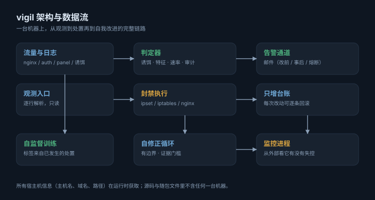
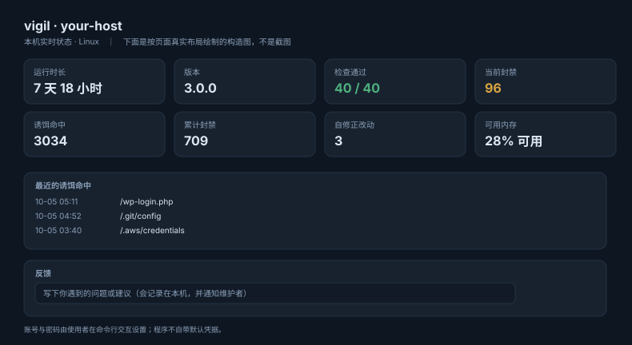
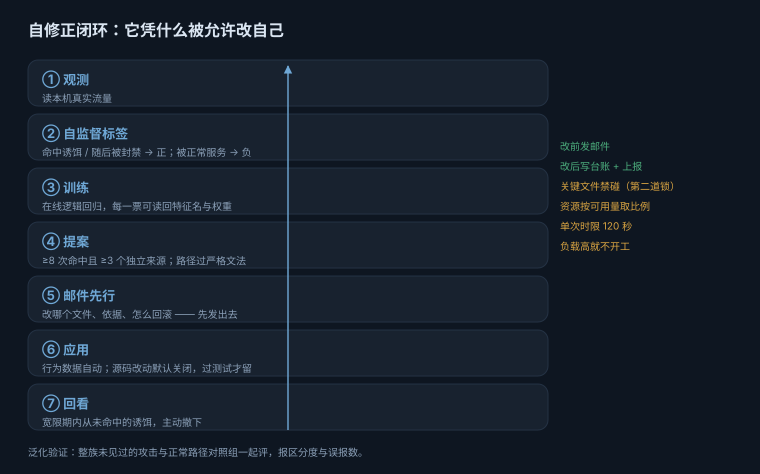

<div align="center">

# vigil

**一台服务器的观测、处置与自我改进。**

检测、封禁、告警、诱饵、自修正 —— 一个不依赖第三方库、可以在锁死网络的机器上跑起来的守护程序。

[](https://github.com/QiuXiYueShiJiu/vigil-guard/actions/workflows/ci.yml)
[](LICENSE)



</div>

---

## 它解决什么

服务器上真正难的不是「发现有人扫描」，而是**在你没看着的时候，它有没有在做正确的事**。

vigil 把四件事放在同一条链路上：**观测**（谁在做什么）、**处置**（该拦的拦住）、
**告知**（该知道的人知道），以及**改进**（下一次判断比上一次准）。
每一环都能单独审计：判了什么、依据是什么、改了什么、怎么退回去。

<div align="center">

</div>

## 开箱即用

```sh
sudo ./install.sh          # 装依赖、部署、跑安装向导
sudo vigil setup           # 一次问答，把管理页面配好
```

`vigil setup` 只问你会真正关心的问题 —— **配哪些管理页面、是否域名访问、用什么端口、
登录方式（密码 / 密码+人机验证）、页面叫什么名字、告警邮箱** —— 然后自动完成反代配置、
证书、凭据哈希与测试邮件。**每个问题的默认值都是保守的**：不问就不对外，
默认只用密码登录，一路回车得到一个只监听本机、但已经能用的工作安装。

```text
$ sudo vigil setup
vigil 快速设置 / 一次问答，把管理页面配好
可配置的管理页面：
  1) status   状态与反馈 —— 本机实时状态、最近的检查项与诱饵命中，附带反馈入口
  2) gate     登录网关概览 —— 各登录网关的配置与命中情况
要配置哪些（逗号分隔序号，all=全部） [all]：
页面显示的名字（留空则用主机名） [ ]：
是否用域名对外访问（否则只监听本机） [y/N]：y
域名（例如 status.example.com）：status.example.com
对外端口（443 表示走 HTTPS） [443]：
本地监听端口 [9177]：
登录方式：1) 只用密码  2) 密码 + 人机验证
选择 [1]：2
登录账号 [admin]：
  设置密码（至少 10 位，不回显）：**********
  再输一次：**********
告警收件邮箱（留空则跳过邮件配置）：you@example.com
  ✔ 账号密码已设置（只保存派生值）
  ✔ 已写入 /www/server/panel/vhost/nginx/status.example.com.conf
  ✔ nginx 配置检查通过     ✔ 已重新加载 nginx
  ✔ 已安装并启动 vigil-web.service
发一封测试邮件确认通道可用……
  ✔ 测试邮件已发出
  ✔ 设置完成
```

## 能力一览

| 能力 | 说明 | 命令 |
|---|---|---|
| **实时威胁处置** | 观测 nginx / auth / 面板日志，按分级策略自动封禁 | `vigil threat` |
| **登录闸门** | 给面板或自建登录页前置人机验证，支持多实例 | `vigil gate` |
| **诱饵与诱导面** | 让扫描器自己撞上诱饵端点，并衡量诱导面是否真的被找到 | `vigil decoy` · `vigil lure` |
| **状态与反馈页** | 实时状态 + 反馈入口；只监听本机、由已有 Web 服务反代 | `vigil web` |
| **自修正** | 自监督训练 + 泛化验证 + 闭环回看；有边界、可回滚、改前发邮件 | `vigil evolve` |
| **请求卫生 / 完整性 / 审计** | 请求行限制、程序自身完整性基线、内核级改动归因 | `vigil hygiene` · `vigil audit` |
| **快速设置** | 一次问答配好管理页面、反代、凭据与测试邮件 | `vigil setup` |

## 自修正：它凭什么被允许改自己

这是本项目最需要解释的部分 —— 一个能改自己的安全组件，风险不在功能少，
而在**限制失效**。

<div align="center">

</div>

**两个层级。** 行为数据（诱饵路径）可以自动采纳，门槛是硬的：≥8 次命中
**且** ≥3 个独立来源，且路径必须过严格文法 —— 含引号、花括号、分号的路径不是
「不好的诱饵」，而是 **nginx 配置注入**。源码改动**默认关闭**，打开后也只能动唯一
一个被许可的文件，并受单一锚点、行数上限、每日次数上限、改前备份、
**测试不过自动还原**五重约束。

**自己训练自己。** 标签不是人标的，是本机**已经发生的处置结果**：命中过诱饵、
或随后被封禁的请求是正样本；被正常服务的是负样本；没有结论的 404 不参与训练
（否则模型只是在重新学习程序自己的拦截行为）。

**而且能力是被验证的，不是被声明的。** `vigil evolve novel` 会把**整族**未见过的
命名习惯排除在训练之外再来考它，并同时给出正常路径的对照组：

| | 识别率（置信阈值 0.70） | 区分度 | 误报 |
|---|---|---|---|
| 完全未训练 | 0/21 | 0.000 | 0 |
| 批量训练后 | 21/21 | 0.994 | 0 |

> 这个测试的第一版对**完全未训练的模型**报出了 100% —— 未训练模型输出恒为 0.5，
> 而阈值写的是 `>= 0.5`；而且只统计「认出多少攻击」，一个把什么都判成攻击的模型
> 同样能拿 100%。现在有测试专门钉住：**空白模型必须通不过这个测试**。

**关键文件禁碰。** 许可表只允许改一个文件，但许可表本身是可编辑的 ——
所以另有一份 `CRITICAL_FILES` 清单，覆盖封禁决策、观测入口、审计链、上报脱敏、
配置、部署、命令入口与整个邮件通道，以及**这个循环自身的边界与资源上限**。
一个能放宽自己限制、或让监督自己的东西失明的 agent，就不是有边界的 agent。

**改前必发邮件。** 新增规则、撤下规则、改动源码 —— 每一次自我修改都先发一封
说明邮件（改什么、依据、怎么回滚），改后写只增台账并可逐条撤销。
这条保证是**结构性**的：所有变更都经过同一个收口函数，而不是靠每处调用点记得。

## 资源占用

按**可用量的比例**给，不写死绝对值 —— 「最多用 200 MB」在 1 GB 小机上太多、
64 GB 机器上太少：

| 键 | 默认 |
|---|---|
| `evolve.memory_pct` | 取**可用**内存的 5% |
| `evolve.memory_floor_mb` | 可用内存低于 96 MB 就不开工 |
| `evolve.load_ratio` | 负载超过 `核数 × 0.7` 就不开工 |

systemd 侧另有硬上限：`CPUQuota=5%`、`Nice=19`、`IOWeight=10`、`MemoryMax=256M`，
并明确标注**不属于告警链路** —— 出问题时它该是第一个被牺牲的。

## 隐私与可移植性

**源码与随包文件里不含任何一台机器的信息。** 这一条由 `core/sourceaudit.py`
在发布关卡里强制检查：公网 IP、域名（含 punycode）、个人邮箱、托管商名、
本机绝对路径，出现即构建失败。

- 主机名、域名、端口、上游地址**全部运行时获取**；
- 上报通道发送前脱敏，服务端再校验一次；
- 归档里不写死路径 —— 否则还原时会把文件放回**错误**的位置，而操作者以为成功了。

## 发布关卡

```sh
scripts/release-check.sh          # 语法 → 全套测试 → 源码审计 → 打包
```

任何一步失败就**不推 tag**。测试若「首轮失败、复跑通过」，脚本会打出
`!! FLAKY !!` 并要求显式 `--allow-flaky` —— 间歇性失败要去找根因，
不能用重跑掩盖它。

## 文档

| 文档 | 内容 |
|---|---|
| [docs/INSTALL.md](docs/INSTALL.md) | 安装与升级 |
| [docs/CONFIGURATION.md](docs/CONFIGURATION.md) | 配置项与自修正开关 |
| [docs/EVOLVE.md](docs/EVOLVE.md) | 自修正：边界、自监督、泛化验证 |
| [docs/WEB.md](docs/WEB.md) | 状态页：交互逻辑与安全取舍 |
| [docs/GATE.md](docs/GATE.md) | 登录闸门 |
| [docs/ARCHITECTURE.md](docs/ARCHITECTURE.md) | 模块结构 |
| [docs/FAQ.md](docs/FAQ.md) | 常见问题 |

## 许可

AGPL-3.0。详见 [LICENSE](LICENSE) 与 [DISCLAIMER.md](DISCLAIMER.md)。

**贡献者**：[@QiuXiYueShiJiu](https://github.com/QiuXiYueShiJiu)
